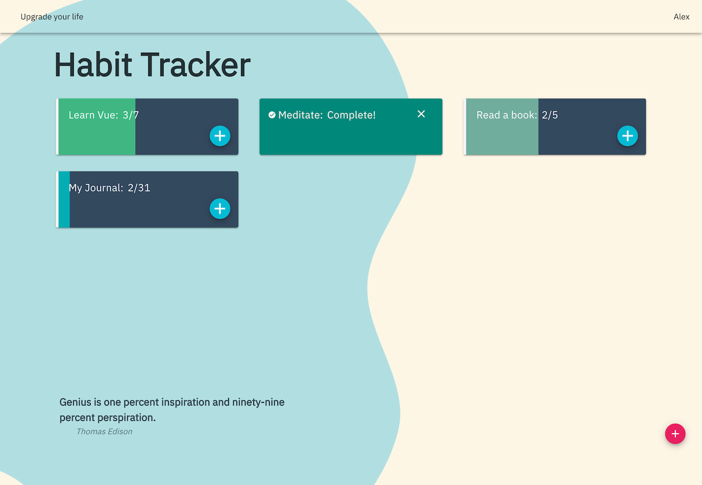

<h1 align="center">
 Habits: Personal Project
</h1>
<div align="center">
  <h3>
    <a href="https://nuxt-habits.netlify.app">
      Demo
    </a>
    <span> | </span>
    <a href="http://alexbaez.dev/projects/habits">
      Info
    </a>
  </h3>
  <p>Te ayuda a registrar los hábitos que deseas que formen parte de tu vida.</p>
</div>



### Stack

- Vue
- Nuxt
- Vuex
- Vuetify

### 🚀 Instructions for to operate project on your local machine

1.  **Clone this repository.**

    ```shell
    git clone https://github.com/alexbaezd/habits.git
    ```

2.  **Build Setup**

```bash
# install dependencies
$ yarn install

# serve with hot reload at localhost:3000
$ yarn dev

# build for production and launch server
$ yarn build
$ yarn start

# generate static project
$ yarn generate
```

For detailed explanation on how things work, check out [Nuxt.js docs](https://nuxtjs.org).
